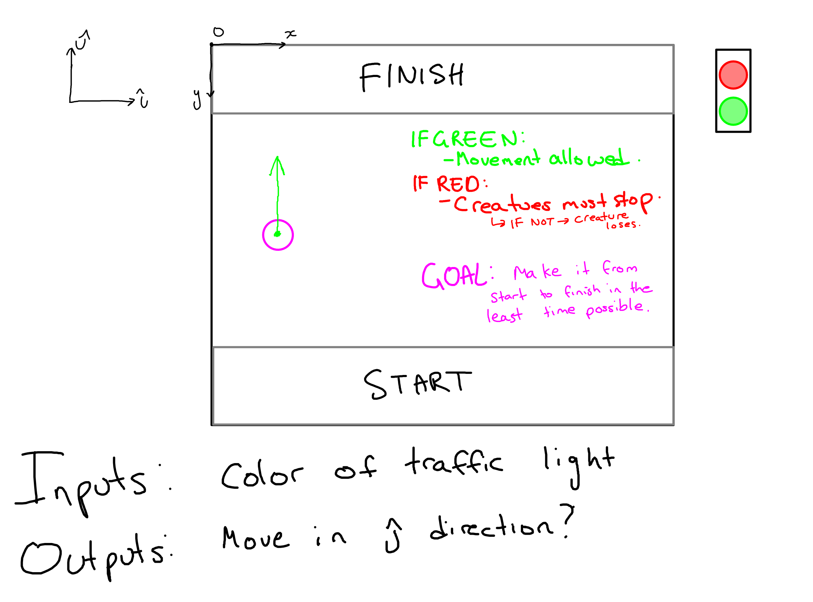
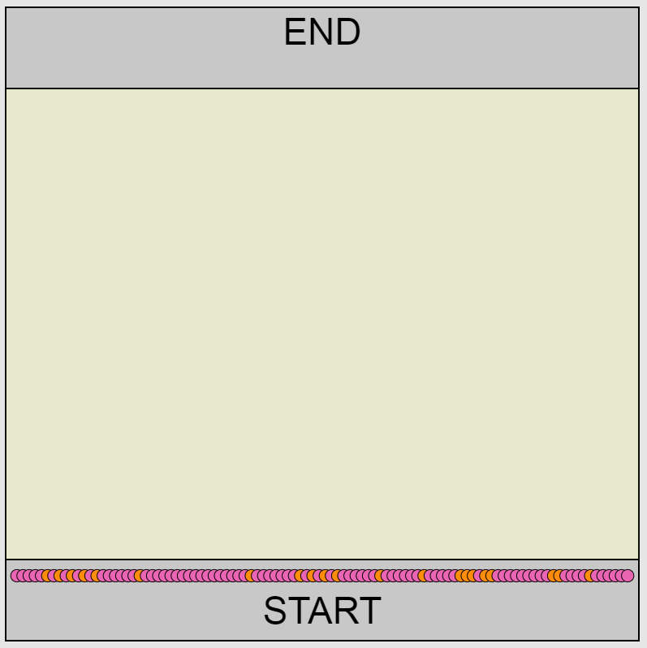

# Red Light, Green Light
A very simple neuralevolution example involving training AIs to play the renowned playground game "Red Light, Green Light".

## Game rules:
For those that have never heard of this game, here are the very basic rules:
- When the traffic light is green, contestants sprint as fast as they can towards the finish line.
- When it is red, they must stop.
- If they are caught moving while the light is red, they are sent back to the start line.

# A quick doodle brainstorm:

# Evolved Behavior:

